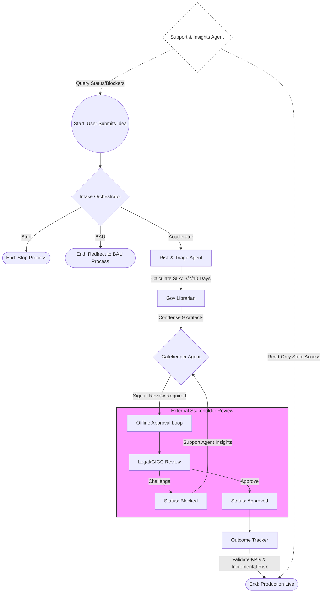

# AI Governance Unit (AIGU)

### "Streamlining AI Governance through Intelligent Orchestration"

AIGU is a state-of-the-art prototype designed to replace fragmented, manual AI governance with a dynamic, agentic workflow. Built on **Google Antigravity** principles, it leverages **LangGraph** for orchestration and **A2UI** for a responsive, state-driven user experience.

---

## 📖 Table of Contents
* [Vision](#-vision)
* [System Architecture](#-system-architecture)
* [The 6-Agent Brain](#-the-6-agent-brain)
* [Technical Stack](#-technical-stack)
* [Getting Started](#-getting-started)
* [Implementation Guardrails](#-implementation-guardrails)

---

## Vision
AIGU moves away from "Checklist Governance" toward **Adaptive Orchestration**. 
* **Dynamic:** UI adapts to project risk (Low/Med/High).
* **Efficient:** Reduces Pilot timelines from 4 months to target SLAs of 3, 7, or 10 days.
* **Transparent:** Real-time status querying via a dedicated Support Agent.

---

## System Architecture
AIGU operates on a **State-Loop** architecture. The React Native frontend acts as a "dumb" terminal that renders components based on the shared "Brain" state managed by LangGraph and persisted in AWS.

---

## The 6-Agent Brain
The logic is distributed across six specialized agents located in `/agents`, powered by **Amazon Nova**:

1.  **Intake Orchestrator**: Routes projects to Accelerator or BAU paths.
2.  **Risk & Triage**: Sets SLAs (3/7/10 days) and triggers risk-based questions.
3.  **Governance Librarian**: Manages the "Single Source of Truth" to prevent data duplication.
4.  **Gatekeeper**: Challenges legacy processes and manages offline horizontal approvals.
5.  **Outcome Tracker**: Validates KPIs and incremental risks for production.
6.  **Support & Insights**: Provides read-only transparency and session recovery.

---

## Technical Stack
* **Engine:** LangGraph (Python/JS)
* **LLM:** **Amazon Nova (Pro/Lite)** via **Amazon Bedrock**
* **UI:** React Native with [A2UI](https://github.com/google/A2UI)
* **Database:** **Amazon DynamoDB** (State Persistence)
* **Compute:** AWS Lambda (Serverless execution of LangGraph nodes)
* **Testing:** Pytest / Jest (Strict TDD)

---

## Getting Started

### Prerequisites
* Python 3.10+ / Node.js 18+
* AWS Account with **Amazon Bedrock** access enabled for Nova models.
* AWS CLI configured with appropriate IAM permissions.
* DynamoDB table configured for state management.

### Installation
1. **Clone the repository:**
   ```bash
   git clone [https://github.com/your-org/aigu-unit.git](https://github.com/your-org/aigu-unit.git)
   cd aigu-unit
   ```
2. **Install Backend Dependencies:**
   ```bash
   pip install -r requirements.txt
   ```
3. **Install Frontend Dependencies:**
   ```bash
   cd ui && npm install
   ```

### Implementation Guardrails
* **Session Recovery:** The app must look up submissionId in DynamoDB on mount to resume progress via the Support Agent.
* **Dynamic Rendering:** Screens must never be hardcoded; use state-driven component mapping (e.g., render specific modules based on Risk Level).
* **Audit Trail:** Every state change must be logged as a permanent entry for full governance compliance.


# diagram
