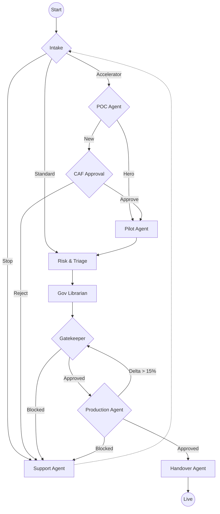
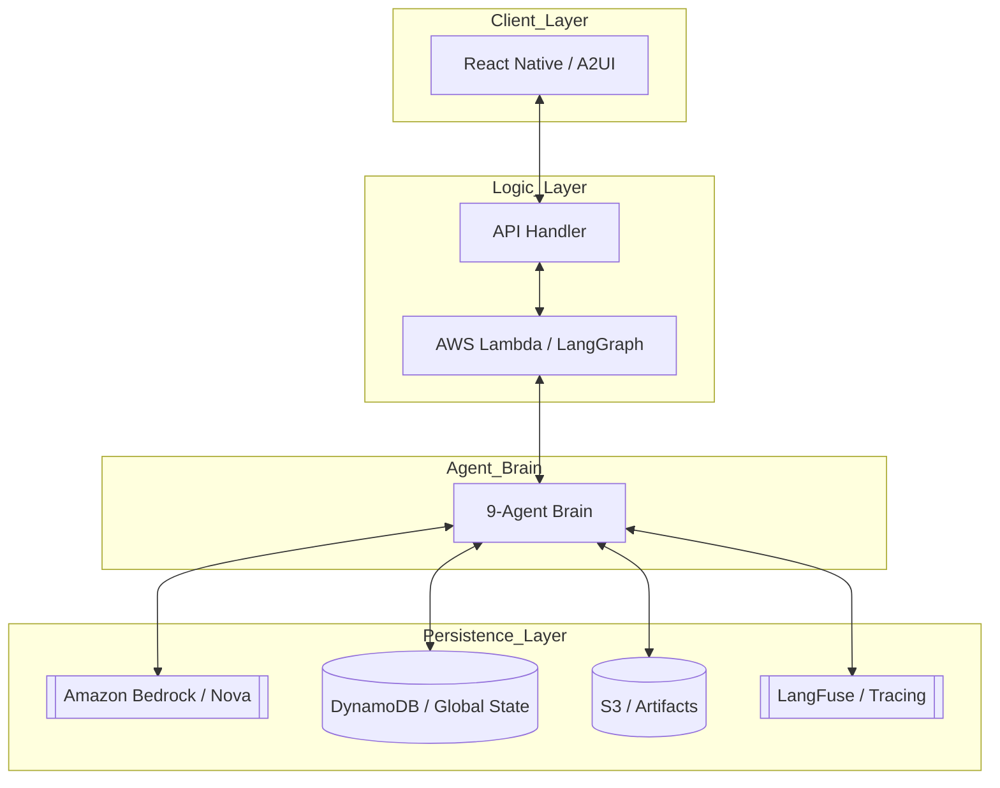

# AI Governance Unit (AIGU)

### "Streamlining AI Governance through Continuous Orchestration"

AIGU is a state-of-the-art prototype designed to replace fragmented, manual AI governance with a dynamic, agentic workflow. Built on **Google Antigravity** principles, it leverages **LangGraph** for orchestration and **A2UI** for a responsive, state-driven user experience.

---

## 📖 Table of Contents
* [Vision](#-vision)
* [System Architecture](#-system-architecture)
* [The 9-Agent Brain](#-the-9-agent-brain)
* [Technical Stack](#-technical-stack)
* [Key Features](#-key-features)
* [Getting Started](#-getting-started)
* [Implementation Guardrails](#-implementation-guardrails)

---

## Vision
AIGU moves away from "Checklist Governance" toward **Continuous Orchestration**. 
* **Lifecycle Integrated:** Tracks projects from POC to Pilot and finally Production.
* **Delta-Driven:** Automatically detects major changes (>15%) and re-triggers governance reviews.
* **Transparent:** Real-time status querying and "Why" insights via a dedicated Support Agent.

---

## System Architecture
AIGU operates on a **State-Loop** architecture. The React Native frontend acts as a "dumb" terminal that renders components based on the shared "Brain" state managed by LangGraph and persisted in AWS.

---

## The 9-Agent Brain
The logic is distributed across nine specialized agents located in `/aigu/agents`, powered by **Amazon Nova**:

1.  **Intake Orchestrator**: Routes projects based on path (Accelerator, BAU, Stop) and stage.
2.  **POC Agent**: Validates proof-of-concept requirements for "New" AI capabilities.
3.  **Pilot Agent**: Manages the pilot phase with risk-based SLA assignment (3/7/10 days).
4.  **Risk & Triage**: Categorizes project risk and triggers stage-specific requirements.
5.  **Governance Librarian**: Manages artifacts and prevents data duplication via automated audits.
6.  **Gatekeeper Agent**: Manages GIGC admin approvals and offline horizontal challenges.
7.  **Production Agent**: Validates KPIs, cost controls, and incremental risks for go-live.
8.  **Handover Agent**: Generates final tasks for IRIS, LCT, and RTB operations teams.
9.  **Support & Insights**: Provides read-only transparency and intelligent session recovery.

---

## Technical Stack
* **Engine:** LangGraph (Python)
* **LLM:** **Amazon Nova (Pro/Lite)** via **Amazon Bedrock**
* **Traceability:** **LangFuse** (Prompt management and observability)
* **UI:** React Native with [A2UI](https://github.com/google/A2UI)
* **Database:** **Amazon DynamoDB** (Global State Persistence)
* **Storage:** **Amazon S3** (Artifact management)
* **Compute:** AWS Lambda
* **Testing:** Pytest (TDD-driven lifecycle simulations)

---

## Key Features
- **Hero vs. New Paths:** "Hero" capabilities skip the POC stage to accelerate delivery.
- **15% Delta Threshold:** Updates to Production projects are analyzed; changes over 15% require full GIGC re-approval.
- **Universal Support Overlay:** Ask any question about project status or governance rules at any stage.

---

## Getting Started

### Prerequisites
* Python 3.10+
* AWS Account with **Amazon Bedrock** access enabled for Nova models.
* DynamoDB tables for LangGraph checkpoints and global state.
* S3 Bucket for artifacts.

### Installation
1. **Clone the repository:**
   ```bash
   git clone [https://github.com/your-org/aigu-unit.git](https://github.com/your-org/aigu-unit.git)
   cd AIGU
   ```
2. **Install Backend Dependencies:**
   ```bash
   pip install -r requirements.txt
   ```
3. **Install Frontend Dependencies:**
   ```bash
   cd ui && npm install
   ```

---

## Flow Diagram


## Internal Architecture
