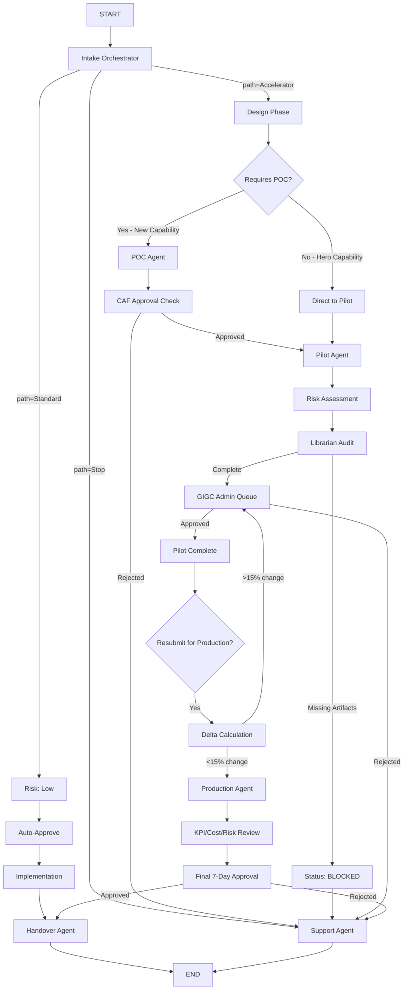

# AIGU Multi-Stage Lifecycle Implementation Specification

**Version**: 2.0  
**Date**: 2026-02-06  
**Status**: 🚧 Implementation Required  
**Estimated Effort**: 4-6 weeks

---

## Executive Summary

This specification outlines the implementation of a **full multi-stage governance lifecycle** for AIGU, aligning the current single-pass workflow with the desired POC → Pilot → Production flow. This upgrade transforms AIGU from a one-time approval system into a **continuous governance platform** that tracks projects through their entire lifecycle.

---

## Table of Contents

1. [Current State Analysis](#current-state-analysis)
2. [Target Architecture](#target-architecture)
3. [New Agent Specifications](#new-agent-specifications)
4. [State Schema Updates](#state-schema-updates)
5. [LangGraph Routing Logic](#langgraph-routing-logic)
6. [Delta Calculation Engine](#delta-calculation-engine)
7. [UI Updates](#ui-updates)
8. [Implementation Phases](#implementation-phases)
9. [Testing Strategy](#testing-strategy)

---

## 1. Current State Analysis

### Existing Flow
```
START → Intake → Risk Triage → Librarian → Gatekeeper → Outcome → END
```

### Issues
- ❌ No POC stage
- ❌ Pilot is a label, not a workflow stage
- ❌ No production controls (KPIs, cost, incremental risk)
- ❌ No delta calculation for version changes
- ❌ No multi-stage resubmission logic

---

## 2. Target Architecture

### New Flow


### Key Changes
1. **POC Agent** - New node for proof-of-concept validation
2. **Pilot Agent** - Dedicated workflow stage (not just a label)
3. **Production Agent** - Handles delta review, KPIs, cost control
4. **Handover Agent** - Renamed from Outcome, handles IRIS/LCT/RTB
5. **Delta Calculation** - Automatic version comparison and routing

---

## 3. New Agent Specifications

### 3.1 POC Agent (`poc_agent.py`)

**Purpose**: Validate proof-of-concept for new AI capabilities

**Inputs**:
- Project description
- Capability type (Hero vs New)
- Technical architecture

**Logic**:
```python
def poc_agent(state: GlobalState) -> GlobalState:
    """
    POC Agent validates proof-of-concept requirements.
    """
    capability_type = state["projectMetadata"].get("capabilityType", "New")
    
    if capability_type == "Hero":
        # Hero capabilities skip POC
        state["projectMetadata"]["currentStage"] = "Pilot"
        state["projectMetadata"]["pocRequired"] = False
        return state
    
    # New capabilities require POC
    state["projectMetadata"]["currentStage"] = "POC"
    state["projectMetadata"]["pocRequired"] = True
    
    # Check for POC artifacts
    poc_artifacts = state["artifacts"].get("pocData", {})
    required_poc_docs = ["testPlan", "successCriteria", "resourceEstimate"]
    
    missing = [doc for doc in required_poc_docs if doc not in poc_artifacts]
    
    if missing:
        state["governance"]["status"] = "Blocked"
        state["governance"]["blockers"] = [f"Missing POC artifact: {doc}" for doc in missing]
        state["ui_overlay"]["supportMessage"] = f"POC stage requires: {', '.join(missing)}"
    else:
        state["governance"]["status"] = "POC-Ready"
        state["ui_overlay"]["supportMessage"] = "POC artifacts complete. Awaiting CAF approval."
    
    return state
```

**Outputs**:
- `currentStage`: "POC"
- `pocRequired`: True/False
- `status`: "POC-Ready" or "Blocked"

---

### 3.2 Pilot Agent (`pilot_agent.py`)

**Purpose**: Manage pilot phase with SLA-based approval workflow

**Inputs**:
- Risk level (Low/Med/High)
- Librarian audit results
- Admin approval status

**Logic**:
```python
def pilot_agent(state: GlobalState) -> GlobalState:
    """
    Pilot Agent manages the pilot phase with SLA tracking.
    """
    risk_level = state["projectMetadata"].get("riskLevel", "Low")
    
    # Set SLA based on risk
    sla_days = {"Low": 3, "Med": 7, "High": 10}.get(risk_level, 7)
    deadline = (datetime.now() + timedelta(days=sla_days)).isoformat()
    
    state["projectMetadata"]["currentStage"] = "Pilot"
    state["governance"]["slaDeadline"] = deadline
    state["governance"]["slaType"] = f"{sla_days}-Day Pilot Review"
    
    # Check if admin approved
    if state["governance"].get("adminApproved"):
        state["governance"]["status"] = "Pilot-Active"
        state["ui_overlay"]["supportMessage"] = (
            f"Your pilot has been approved! SLA: {sla_days} days. "
            f"Expected completion: {deadline[:10]}"
        )
    else:
        state["governance"]["status"] = "Pending"
        state["ui_overlay"]["supportMessage"] = (
            f"Your project is in the GIGC admin queue. "
            f"SLA: {sla_days} days for review."
        )
    
    return state
```

**Outputs**:
- `currentStage`: "Pilot"
- `slaDeadline`: ISO timestamp
- `status`: "Pilot-Active" or "Pending"

---

### 3.3 Production Agent (`production_agent.py`)

**Purpose**: Handle production deployment with delta review and controls

**Inputs**:
- Previous version ID (if resubmission)
- Delta percentage
- KPIs and cost data

**Logic**:
```python
def production_agent(state: GlobalState) -> GlobalState:
    """
    Production Agent handles production deployment with delta review.
    """
    state["projectMetadata"]["currentStage"] = "Production"
    
    # Check for delta review
    previous_version = state["projectMetadata"].get("previousVersionId")
    
    if previous_version:
        # This is a resubmission from Pilot
        delta_pct = state["projectMetadata"].get("deltaPercentage", 0)
        
        if delta_pct > 15:
            # Exceeds threshold - route back to admin
            state["governance"]["status"] = "Pending"
            state["governance"]["blockers"] = [
                f"Delta threshold exceeded: {delta_pct}% (limit: 15%)"
            ]
            state["ui_overlay"]["supportMessage"] = (
                f"Your changes ({delta_pct}%) exceed the 15% delta threshold. "
                "Routing to GIGC for full review."
            )
            return state
    
    # Production controls checklist
    required_controls = {
        "kpiMetrics": "Benefits and KPI measurements",
        "costAnalysis": "Cost control documentation",
        "incrementalRisk": "Incremental risk assessment",
        "outcomeReport": "Pilot outcome report"
    }
    
    missing = []
    for key, description in required_controls.items():
        if key not in state["artifacts"].get("productionData", {}):
            missing.append(description)
    
    if missing:
        state["governance"]["status"] = "Blocked"
        state["governance"]["blockers"] = [f"Missing: {item}" for item in missing]
        state["ui_overlay"]["supportMessage"] = (
            f"Production stage requires {len(missing)} additional artifacts. "
            "Please upload the required documentation."
        )
    else:
        state["governance"]["status"] = "Production-Ready"
        state["governance"]["slaDeadline"] = (
            datetime.now() + timedelta(days=7)
        ).isoformat()
        state["ui_overlay"]["supportMessage"] = (
            "Production artifacts complete. Awaiting final 7-day approval."
        )
    
    return state
```

**Outputs**:
- `currentStage`: "Production"
- `deltaPercentage`: Float (if resubmission)
- `status`: "Production-Ready" or "Blocked"

---

### 3.4 Handover Agent (`handover_agent.py`)

**Purpose**: Final handover to IRIS/LCT/RTB (renamed from Outcome)

**Logic**:
```python
def handover_agent(state: GlobalState) -> GlobalState:
    """
    Handover Agent manages final transition to operations.
    """
    state["projectMetadata"]["currentStage"] = "Handover"
    state["governance"]["status"] = "Approved"
    
    # Generate handover checklist
    handover_tasks = [
        "IRIS: Engagement plan created",
        "LCT: Residual risks logged",
        "RTB: Operations team notified"
    ]
    
    state["artifacts"]["handoverData"] = {
        "tasks": handover_tasks,
        "completionDate": datetime.now().isoformat(),
        "finalStatus": "Live in Production"
    }
    
    state["ui_overlay"]["supportMessage"] = (
        "🎉 Congratulations! Your project has been approved and is now live. "
        "Handover tasks have been assigned to IRIS, LCT, and RTB teams."
    )
    
    return state
```

---

## 4. State Schema Updates

### 4.1 New `projectMetadata` Fields

```python
{
    "projectMetadata": {
        # Existing fields
        "name": str,
        "riskLevel": "Low" | "Med" | "High",
        "currentStage": str,
        "path": str,
        
        # NEW FIELDS
        "capabilityType": "Hero" | "New",  # Determines POC requirement
        "pocRequired": bool,
        "previousVersionId": str,  # For delta comparison
        "deltaPercentage": float,  # Calculated change percentage
        "lifecyclePhase": "POC" | "Pilot" | "Production",  # Overall phase
        "versionHistory": [
            {
                "versionId": str,
                "stage": str,
                "timestamp": str,
                "changes": str
            }
        ]
    }
}
```

### 4.2 New `artifacts` Sections

```python
{
    "artifacts": {
        # Existing
        "intakeData": {...},
        
        # NEW SECTIONS
        "pocData": {
            "testPlan": str,
            "successCriteria": str,
            "resourceEstimate": str,
            "cafApprovalStatus": "Pending" | "Approved" | "Rejected"
        },
        "pilotData": {
            "pilotStartDate": str,
            "pilotEndDate": str,
            "pilotResults": str,
            "lessonsLearned": str
        },
        "productionData": {
            "kpiMetrics": {...},
            "costAnalysis": {...},
            "incrementalRisk": str,
            "outcomeReport": str
        },
        "handoverData": {
            "tasks": [str],
            "completionDate": str,
            "finalStatus": str
        }
    }
}
```

---

## 5. LangGraph Routing Logic

### 5.1 Updated `graph.py`

```python
from aigu.agents.poc import poc_agent
from aigu.agents.pilot import pilot_agent
from aigu.agents.production import production_agent
from aigu.agents.handover import handover_agent

def build_aigu_graph():
    workflow = StateGraph(GlobalState)
    
    # Add all nodes
    workflow.add_node("intake", intake_orchestrator)
    workflow.add_node("design", design_phase_agent)  # NEW
    workflow.add_node("poc", poc_agent)  # NEW
    workflow.add_node("pilot", pilot_agent)  # NEW
    workflow.add_node("risk_triage", risk_triage_agent)
    workflow.add_node("librarian", librarian_agent)
    workflow.add_node("gatekeeper", gatekeeper_agent)
    workflow.add_node("production", production_agent)  # NEW
    workflow.add_node("handover", handover_agent)  # RENAMED from outcome
    workflow.add_node("support", support_agent)
    
    # Core routing
    workflow.add_edge(START, "intake")
    
    def route_intake(state: GlobalState) -> str:
        path = state.get("projectMetadata", {}).get("path", "Stop")
        if path == "Stop":
            return "support"
        elif path == "Standard":
            return "risk_triage"  # Low risk → auto-approve
        else:  # Accelerator
            return "design"
    
    workflow.add_conditional_edges("intake", route_intake)
    
    # Design phase routing
    def route_design(state: GlobalState) -> str:
        capability = state.get("projectMetadata", {}).get("capabilityType", "New")
        return "poc" if capability == "New" else "pilot"
    
    workflow.add_conditional_edges("design", route_design)
    
    # POC routing
    def route_poc(state: GlobalState) -> str:
        caf_status = state.get("artifacts", {}).get("pocData", {}).get("cafApprovalStatus")
        return "pilot" if caf_status == "Approved" else "support"
    
    workflow.add_conditional_edges("poc", route_poc)
    
    # Standard path (auto-approve)
    workflow.add_edge("risk_triage", "handover")
    
    # Pilot path
    workflow.add_edge("pilot", "risk_triage")  # Re-assess risk for pilot
    workflow.add_edge("librarian", "gatekeeper")
    
    def route_gatekeeper(state: GlobalState) -> str:
        status = state.get("governance", {}).get("status")
        if status == "Approved":
            # Check if this is pilot completion or production submission
            stage = state.get("projectMetadata", {}).get("currentStage")
            if stage == "Pilot":
                return "production"  # Move to production review
            else:
                return "handover"
        return "support"
    
    workflow.add_conditional_edges("gatekeeper", route_gatekeeper)
    
    # Production routing with delta check
    def route_production(state: GlobalState) -> str:
        delta = state.get("projectMetadata", {}).get("deltaPercentage", 0)
        if delta > 15:
            return "gatekeeper"  # Re-route to admin for full review
        status = state.get("governance", {}).get("status")
        return "handover" if status == "Production-Ready" else "support"
    
    workflow.add_conditional_edges("production", route_production)
    
    workflow.add_edge("handover", END)
    workflow.add_edge("support", END)
    
    # Persistence setup (unchanged)
    checkpointer = DynamoDBSaver(...)
    return workflow.compile(checkpointer=checkpointer)
```

---

## 6. Delta Calculation Engine

### 6.1 `delta_calculator.py`

```python
"""
Delta Calculation Engine
Compares current version with previous version to determine change percentage.
"""

from typing import Dict, Any
import difflib

def calculate_delta(current_state: Dict, previous_state: Dict) -> float:
    """
    Calculate the percentage change between two project versions.
    
    Returns:
        float: Percentage change (0-100)
    """
    weights = {
        "scope": 0.3,
        "data_sources": 0.25,
        "security_controls": 0.25,
        "architecture": 0.2
    }
    
    total_change = 0.0
    
    # Compare scope
    current_scope = current_state.get("artifacts", {}).get("intakeData", {}).get("description", "")
    previous_scope = previous_state.get("artifacts", {}).get("intakeData", {}).get("description", "")
    scope_similarity = difflib.SequenceMatcher(None, current_scope, previous_scope).ratio()
    total_change += (1 - scope_similarity) * weights["scope"]
    
    # Compare data sources
    current_sources = set(current_state.get("artifacts", {}).get("intakeData", {}).get("dataSources", []))
    previous_sources = set(previous_state.get("artifacts", {}).get("intakeData", {}).get("dataSources", []))
    
    if previous_sources:
        added = len(current_sources - previous_sources)
        removed = len(previous_sources - current_sources)
        source_change = (added + removed) / len(previous_sources)
        total_change += min(source_change, 1.0) * weights["data_sources"]
    
    # Compare security controls
    current_security = current_state.get("artifacts", {}).get("intakeData", {}).get("securityControls", "")
    previous_security = previous_state.get("artifacts", {}).get("intakeData", {}).get("securityControls", "")
    security_similarity = difflib.SequenceMatcher(None, current_security, previous_security).ratio()
    total_change += (1 - security_similarity) * weights["security_controls"]
    
    # Compare architecture
    current_arch = current_state.get("artifacts", {}).get("intakeData", {}).get("architecture", "")
    previous_arch = previous_state.get("artifacts", {}).get("intakeData", {}).get("architecture", "")
    arch_similarity = difflib.SequenceMatcher(None, current_arch, previous_arch).ratio()
    total_change += (1 - arch_similarity) * weights["architecture"]
    
    return round(total_change * 100, 2)

def get_delta_details(current_state: Dict, previous_state: Dict) -> Dict[str, Any]:
    """
    Get detailed breakdown of changes for UI display.
    """
    details = {
        "deltaPercentage": calculate_delta(current_state, previous_state),
        "changes": []
    }
    
    # Identify specific changes
    current_desc = current_state.get("artifacts", {}).get("intakeData", {}).get("description", "")
    previous_desc = previous_state.get("artifacts", {}).get("intakeData", {}).get("description", "")
    
    if current_desc != previous_desc:
        details["changes"].append({
            "field": "Project Scope",
            "type": "modified",
            "description": "Project description has been updated"
        })
    
    current_sources = set(current_state.get("artifacts", {}).get("intakeData", {}).get("dataSources", []))
    previous_sources = set(previous_state.get("artifacts", {}).get("intakeData", {}).get("dataSources", []))
    
    added_sources = current_sources - previous_sources
    removed_sources = previous_sources - current_sources
    
    if added_sources:
        details["changes"].append({
            "field": "Data Sources",
            "type": "added",
            "description": f"Added: {', '.join(added_sources)}"
        })
    
    if removed_sources:
        details["changes"].append({
            "field": "Data Sources",
            "type": "removed",
            "description": f"Removed: {', '.join(removed_sources)}"
        })
    
    return details
```

---

## 7. UI Updates

### 7.1 WorkflowProgress Component Updates

Update the stages array to include all new phases:

```javascript
const stages = [
    { name: 'Intake', key: 'Intake' },
    { name: 'Design', key: 'Design' },
    { name: 'POC', key: 'POC' },
    { name: 'Pilot', key: 'Pilot' },
    { name: 'Risk', key: 'Risk' },
    { name: 'Librarian', key: 'Librarian' },
    { name: 'GIGC', key: 'Gatekeeper' },
    { name: 'Production', key: 'Production' },
    { name: 'Handover', key: 'Handover' }
];
```

### 7.2 AdminQueue Delta View

Replace placeholder with real delta calculation:

```javascript
const handleViewDelta = async (item) => {
    const response = await actions.calculateDelta(
        item.submissionId,
        item.userId,
        item.projectMetadata.previousVersionId
    );
    
    setDeltaData(response);
    setDeltaModal(item);
};
```

### 7.3 New POC Submission Screen

Create `POCSubmission.js`:

```javascript
const POCSubmission = ({ state, actions }) => {
    const [testPlan, setTestPlan] = useState('');
    const [successCriteria, setSuccessCriteria] = useState('');
    const [resourceEstimate, setResourceEstimate] = useState('');
    
    const handleSubmit = async () => {
        await actions.submitPOC({
            testPlan,
            successCriteria,
            resourceEstimate
        });
    };
    
    return (
        <View>
            <Text>POC Submission</Text>
            {/* Form fields */}
        </View>
    );
};
```

---

## 8. Implementation Phases

### Phase 1: Foundation (Week 1-2)
**Goal**: Add new agent files and update state schema

**Tasks**:
1. ✅ Create `poc_agent.py`
2. ✅ Create `pilot_agent.py`
3. ✅ Create `production_agent.py`
4. ✅ Rename `outcome_agent.py` to `handover_agent.py`
5. ✅ Update `state.py` with new fields
6. ✅ Create `delta_calculator.py`
7. ✅ Update DynamoDB schema

**Deliverables**:
- All agent files created
- State schema updated
- Delta calculation engine functional

---

### Phase 2: LangGraph Integration (Week 3)
**Goal**: Update routing logic and test workflow

**Tasks**:
1. ✅ Update `graph.py` with new nodes
2. ✅ Implement conditional routing functions
3. ✅ Add delta check routing
4. ✅ Update `handler.py` to support new agents
5. ✅ Write unit tests for each agent
6. ✅ Test end-to-end flow

**Deliverables**:
- Updated LangGraph with all stages
- Routing logic tested
- E2E test passing

---

### Phase 3: UI Implementation (Week 4)
**Goal**: Update frontend to support new workflow

**Tasks**:
1. ✅ Update WorkflowProgress component
2. ✅ Create POCSubmission screen
3. ✅ Update AdminQueue with real delta calculation
4. ✅ Add production controls checklist
5. ✅ Update SupportStatus with new stages
6. ✅ Add version history viewer

**Deliverables**:
- All UI screens updated
- Delta comparison functional
- User can navigate full lifecycle

---

### Phase 4: Testing & Refinement (Week 5-6)
**Goal**: End-to-end testing and bug fixes

**Tasks**:
1. ✅ Create test projects for each path
2. ✅ Test POC → Pilot → Production flow
3. ✅ Test delta threshold routing
4. ✅ Test admin approval at each stage
5. ✅ Performance testing
6. ✅ Documentation updates

**Deliverables**:
- All flows tested
- Performance benchmarks met
- Documentation complete

---

## 9. Testing Strategy

### 9.1 Unit Tests

```python
# tests/test_poc_agent.py
def test_poc_agent_hero_capability():
    state = {
        "projectMetadata": {"capabilityType": "Hero"},
        "artifacts": {},
        "governance": {}
    }
    result = poc_agent(state)
    assert result["projectMetadata"]["currentStage"] == "Pilot"
    assert result["projectMetadata"]["pocRequired"] == False

def test_poc_agent_new_capability_missing_docs():
    state = {
        "projectMetadata": {"capabilityType": "New"},
        "artifacts": {"pocData": {}},
        "governance": {}
    }
    result = poc_agent(state)
    assert result["governance"]["status"] == "Blocked"
    assert len(result["governance"]["blockers"]) > 0
```

### 9.2 Integration Tests

```python
# tests/test_e2e_lifecycle.py
def test_full_accelerator_path():
    """Test complete POC → Pilot → Production flow"""
    # Submit intake
    state = submit_intake(project_data)
    assert state["projectMetadata"]["path"] == "Accelerator"
    
    # Design phase
    state = invoke_agent("design", state)
    assert state["projectMetadata"]["currentStage"] == "Design"
    
    # POC phase
    state = submit_poc_artifacts(state)
    state = invoke_agent("poc", state)
    assert state["projectMetadata"]["currentStage"] == "POC"
    
    # Pilot phase
    state = invoke_agent("pilot", state)
    assert state["projectMetadata"]["currentStage"] == "Pilot"
    
    # Admin approval
    state = admin_approve(state)
    assert state["governance"]["status"] == "Pilot-Active"
    
    # Production submission
    state = submit_production_data(state)
    state = invoke_agent("production", state)
    assert state["projectMetadata"]["currentStage"] == "Production"
    
    # Final approval
    state = admin_approve(state)
    state = invoke_agent("handover", state)
    assert state["governance"]["status"] == "Approved"
```

### 9.3 Delta Calculation Tests

```python
# tests/test_delta_calculator.py
def test_delta_no_change():
    current = {"artifacts": {"intakeData": {"description": "Test"}}}
    previous = {"artifacts": {"intakeData": {"description": "Test"}}}
    assert calculate_delta(current, previous) == 0.0

def test_delta_major_change():
    current = {"artifacts": {"intakeData": {
        "description": "Completely different project",
        "dataSources": ["A", "B", "C"]
    }}}
    previous = {"artifacts": {"intakeData": {
        "description": "Original project",
        "dataSources": ["X"]
    }}}
    delta = calculate_delta(current, previous)
    assert delta > 15.0  # Should exceed threshold
```

---

## 10. Success Criteria

### Functional Requirements
- ✅ Projects can progress through POC → Pilot → Production
- ✅ Delta calculation correctly identifies changes > 15%
- ✅ Admin queue shows projects at each stage
- ✅ SLA tracking works for 3/7/10 day timelines
- ✅ Version history is maintained

### Performance Requirements
- ✅ Delta calculation completes in < 2 seconds
- ✅ Agent invocations complete in < 5 seconds
- ✅ UI updates reflect state changes within 1 second

### User Experience
- ✅ Users can see their current lifecycle phase
- ✅ Admins can review projects at POC, Pilot, and Production stages
- ✅ Delta comparison is clear and actionable
- ✅ Blockers are specific and helpful

---

## 11. Rollout Plan

### Week 1-2: Development
- Implement all agents
- Update state schema
- Create delta calculator

### Week 3: Integration
- Update LangGraph
- Test routing logic
- Deploy to dev environment

### Week 4: UI Development
- Update all screens
- Add new components
- Test user flows

### Week 5: Testing
- E2E testing
- Performance testing
- Bug fixes

### Week 6: Production Deployment
- Deploy to production
- Monitor metrics
- Gather user feedback

---

## 12. Risks & Mitigations

| Risk | Impact | Mitigation |
|------|--------|------------|
| Delta calculation too slow | High | Cache previous versions, optimize algorithm |
| State schema changes break existing projects | High | Migration script, backward compatibility |
| Complex routing confuses users | Medium | Clear UI indicators, help documentation |
| Admin queue overwhelmed with multi-stage reviews | Medium | Batch approvals, delegation features |

---

## Conclusion

This specification provides a complete roadmap for implementing the full multi-stage governance lifecycle in AIGU. The phased approach ensures we can deliver incrementally while maintaining system stability.

**Next Steps**:
1. Review and approve this specification
2. Begin Phase 1 implementation
3. Set up weekly progress reviews
4. Track against success criteria

**Estimated Timeline**: 6 weeks to full production deployment
