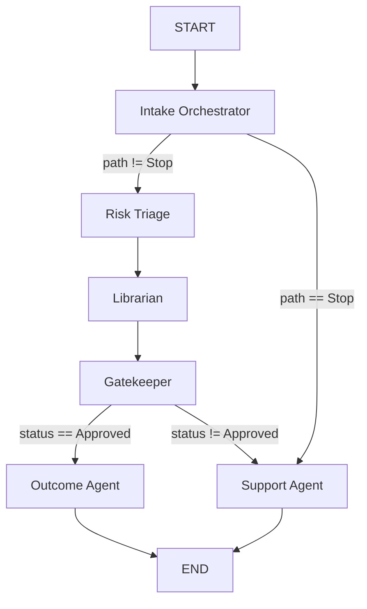
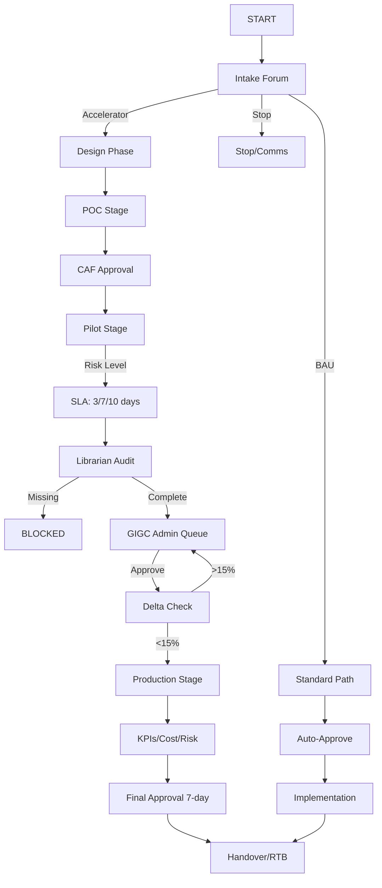

# AIGU Flow Comparison: Desired vs Current Implementation

## Executive Summary

**Status**: ⚠️ **PARTIAL MATCH** - Core concepts align, but implementation has gaps

The current AIGU implementation captures the **spirit** of the desired governance flow but is missing several key stages and decision points. Below is a detailed mapping.

---

## Side-by-Side Comparison

### ✅ MATCHES (What We Have)

| Desired Stage | Current Implementation | Status |
|---------------|------------------------|--------|
| **Template for Intake** | ✅ Discovery Canvas → Intake Orchestrator | ✅ Implemented |
| **Triage based on criteria** | ✅ Risk Triage Agent (Low/Med/High) | ✅ Implemented |
| **Intake Forum Decision** | ✅ Intake → Accelerator/BAU/Stop paths | ✅ Implemented |
| **Risk Level SLA** | ✅ 3-day (Low), 7-day (Med), 10-day (High) | ✅ Implemented |
| **Librarian Audit** | ✅ Librarian Agent checks artifacts | ✅ Implemented |
| **GIGC Admin Queue** | ✅ AdminQueue.js for manual review | ✅ Implemented |
| **Offline Approval** | ✅ Admin APPROVE/REQUEST INFO actions | ✅ Implemented |
| **Delta Check (15%)** | ⚠️ Logic exists in temp.md, not in code | ⚠️ Placeholder only |

---

### ❌ GAPS (What We're Missing)

| Desired Stage | Current Status | Impact |
|---------------|----------------|--------|
| **POC Stage** | ❌ Not implemented | Missing entire POC phase |
| **Pilot Stage** | ⚠️ Mentioned in metadata, no dedicated agent | Pilot is a label, not a workflow stage |
| **Production Stage** | ⚠️ "Outcome" agent exists, but no Prod-specific logic | No incremental risk measurement |
| **Design/Architecture Phase** | ❌ Not implemented | No "Hero Capability" vs "New Capability" distinction |
| **Offline CAF Approval** | ❌ Not implemented | No CAF integration |
| **Benefits/KPIs Tracking** | ❌ Not implemented | No outcome measurement |
| **Cost Control** | ❌ Not implemented | No cost tracking |
| **Final 7-Day Production Approval** | ❌ Not implemented | Production approval is missing |

---

## Detailed Flow Mapping

### 1. **Intake & Triage** ✅ GOOD MATCH

**Desired Flow:**
```
Start → Template → AutoCheck → Triage → Intake Forum → Decision (Accelerator/BAU/Stop)
```

**Current Implementation:**
```python
# graph.py
START → intake_orchestrator → route_intake(path) → {risk_triage | support}
```

**Mapping:**
- ✅ Discovery Canvas = Template
- ✅ Intake Orchestrator = Intake Forum
- ✅ `path` attribute = Decision (Accelerator/Standard/Stop)
- ✅ Risk Triage Agent = Triage based on criteria

---

### 2. **POC Stage** ❌ MISSING

**Desired Flow:**
```
Design → POC → Test → Offline CAF Approval → Pilot
```

**Current Implementation:**
- ❌ No POC stage
- ❌ No CAF approval mechanism
- ❌ Projects go directly from Intake → Risk → Librarian

**Recommendation:**
Add a new `poc_agent` node between `intake` and `risk_triage` for projects flagged as "New Capability"

---

### 3. **Pilot Stage** ⚠️ PARTIAL

**Desired Flow:**
```
Pilot → Risk Level → {DRA 3-day | Med 7-day | High 10-day} → Additional Questions → Offline Approval
```

**Current Implementation:**
```python
# Current: Pilot is just a metadata label
projectMetadata.currentStage = "Pilot"
projectMetadata.path = "Pilot"  # or "Accelerator"
```

**Issues:**
- ✅ SLA tiers exist (3/7/10 days)
- ✅ Admin approval exists (GIGC queue)
- ❌ No dedicated `pilot_agent` to handle pilot-specific logic
- ❌ "Pilot" is a label in `currentStage`, not a workflow node

**Recommendation:**
Add a `pilot_agent` node after `gatekeeper` approval that:
- Sets `currentStage = "Pilot"`
- Monitors pilot progress
- Triggers production review when pilot completes

---

### 4. **Production Stage** ⚠️ PARTIAL

**Desired Flow:**
```
Pilot → Production → Review Results → Benefits/KPIs → Cost Control → Incremental Risk → Final Approval (7-day)
```

**Current Implementation:**
```python
# graph.py
gatekeeper → outcome_agent → END
```

**Issues:**
- ✅ `outcome_agent` exists
- ❌ No production-specific controls (KPIs, cost, incremental risk)
- ❌ No 7-day production approval process
- ❌ No delta measurement (15% rule)

**Recommendation:**
Refactor `outcome_agent` into:
1. `production_agent` - Handles delta review, incremental risk, KPIs
2. `handover_agent` - Final handover to IRIS/LCT/RTB

---

### 5. **Delta Logic (15% Rule)** ⚠️ PLACEHOLDER ONLY

**Desired Flow:**
```
Pilot → Resubmit for Prod → Delta Check > 15%? → {Yes: Admin Queue | No: Production}
```

**Current Implementation:**
```javascript
// AdminQueue.js - Delta modal exists but shows placeholder data
const previousVersionId = item.projectMetadata?.previousVersionId;
// Modal shows: "Delta Threshold: 18% (Exceeds 15% limit)"
// But this is hardcoded, not calculated
```

**Issues:**
- ✅ UI modal exists for delta comparison
- ❌ No backend logic to calculate delta
- ❌ No version control integration
- ❌ No automatic routing based on delta threshold

**Recommendation:**
Implement delta calculation in backend:
```python
def calculate_delta(current_version, previous_version):
    # Compare artifacts, scope, data sources, etc.
    # Return percentage change
    pass

def route_production(state):
    if state.get("projectMetadata", {}).get("previousVersionId"):
        delta = calculate_delta(state, previous_version)
        if delta > 0.15:
            return "gatekeeper"  # Re-route to admin queue
    return "production"
```

---

## Current LangGraph Flow (Simplified)



---

## Desired Flow (From Your Diagram)



---

## Gap Analysis Summary

### Critical Gaps (High Priority)
1. ❌ **POC Stage** - Entire phase missing
2. ❌ **Production Stage Controls** - No KPI/cost/incremental risk tracking
3. ❌ **Delta Calculation** - 15% rule not implemented
4. ❌ **Final Production Approval** - No 7-day production review

### Medium Priority
5. ⚠️ **Pilot Agent** - Pilot is a label, not a workflow stage
6. ⚠️ **Design Phase** - No Hero vs New Capability distinction
7. ⚠️ **CAF Integration** - No offline CAF approval mechanism

### Low Priority (Nice to Have)
8. ❌ **Benefits Tracking** - No KPI measurement
9. ❌ **Cost Control** - No cost tracking
10. ❌ **Outcome Reporting** - No structured outcome reports

---

## Recommendations

### Phase 1: Core Flow Alignment (1-2 weeks)
1. Add `poc_agent` node for POC stage
2. Split `outcome_agent` into `production_agent` and `handover_agent`
3. Implement delta calculation logic
4. Add conditional routing based on delta threshold

### Phase 2: Production Controls (2-3 weeks)
5. Add KPI tracking to `production_agent`
6. Implement incremental risk measurement
7. Add 7-day production approval workflow
8. Integrate cost control checks

### Phase 3: Advanced Features (3-4 weeks)
9. Add CAF approval integration
10. Implement Hero vs New Capability routing
11. Add outcome reporting and benefits tracking
12. Build version control for delta comparison

---

## Conclusion

**Current State**: The AIGU system implements the **core governance concepts** (intake, risk triage, librarian, admin approval) but is missing the **multi-stage lifecycle** (POC → Pilot → Production) that the desired flow requires.

**Next Steps**: 
1. Decide if we want to implement the full POC/Pilot/Production lifecycle
2. Prioritize which gaps to address first
3. Update the LangGraph to add missing nodes and routing logic

The good news: The **architecture is sound** and can accommodate these additions without major refactoring. The DynamoDB state schema already supports `currentStage` and `previousVersionId`, so we have the foundation in place.
