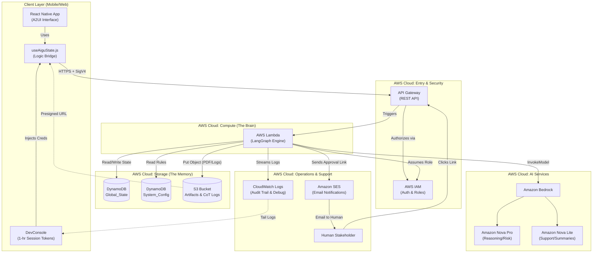

```mermaid
graph TD
    %% --- Client Side ---
    subgraph "Client Layer (Mobile/Web)"
        A2UI["React Native App\n(A2UI Interface)"]
        DevCon["DevConsole\n(1-hr Session Tokens)"]
        Hook["useAiguState.js\n(Logic Bridge)"]
        
        A2UI -- Uses --> Hook
        DevCon -- Injects Creds --> Hook
    end

    %% --- Entry Point ---
    subgraph "AWS Cloud: Entry & Security"
        APIG["API Gateway\n(REST API)"]
        IAM["AWS IAM\n(Auth & Roles)"]
        
        Hook -- "HTTPS + SigV4" --> APIG
        APIG -- "Authorizes via" --> IAM
    end

    %% --- Compute & Logic ---
    subgraph "AWS Cloud: Compute (The Brain)"
        Orchestrator["AWS Lambda\n(LangGraph Engine)"]
        
        APIG -- Triggers --> Orchestrator
        Orchestrator -- "Assumes Role" --> IAM
    end

    %% --- Intelligence ---
    subgraph "AWS Cloud: AI Services"
        Bedrock["Amazon Bedrock"]
        NovaPro["Amazon Nova Pro\n(Reasoning/Risk)"]
        NovaLite["Amazon Nova Lite\n(Support/Summaries)"]
        
        Orchestrator -- InvokeModel --> Bedrock
        Bedrock --> NovaPro
        Bedrock --> NovaLite
    end

    %% --- Persistence ---
    subgraph "AWS Cloud: Storage (The Memory)"
        DDB_State[("DynamoDB\nGlobal_State")]
        DDB_Config[("DynamoDB\nSystem_Config")]
        S3_Bucket[("S3 Bucket\nArtifacts & CoT Logs")]
        
        Orchestrator -- "Read/Write State" --> DDB_State
        Orchestrator -- "Read Rules" --> DDB_Config
        Orchestrator -- "Put Object (PDF/Logs)" --> S3_Bucket
    end

    %% --- Operational Services ---
    subgraph "AWS Cloud: Operations & Support"
        CW_Logs["CloudWatch Logs\n(Audit Trail & Debug)"]
        SES["Amazon SES\n(Email Notifications)"]
        
        Orchestrator -- "Streams Logs" --> CW_Logs
        Orchestrator -- "Sends Approval Link" --> SES
        SES -- "Email to Human" --> Human["Human Stakeholder"]
        Human -- "Clicks Link" --> APIG
    end
    
    %% --- Data Flows ---
    S3_Bucket -.->|"Presigned URL"| Hook
    CW_Logs -.->|"Tail Logs"| DevCon
```