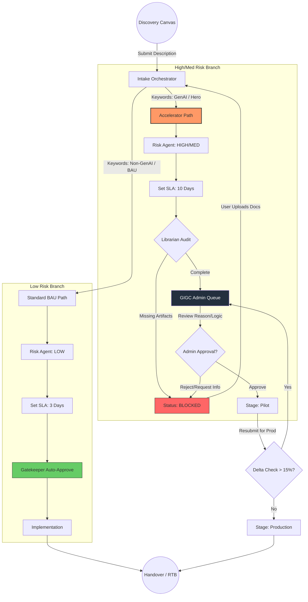

```mermaid
graph TD
    %% Start Node
    Start((Discovery Canvas)) -->|Submit Description| Intake[Intake Orchestrator]

    %% Branching Logic
    Intake -->|Keywords: GenAI / Hero| PathA[Accelerator Path]
    Intake -->|Keywords: Non-GenAI / BAU| PathB[Standard BAU Path]

    %% Accelerator Branch
    subgraph Accelerator_Branch [High/Med Risk Branch]
    PathA --> RiskH[Risk Agent: HIGH/MED]
    RiskH --> SLA10[Set SLA: 10 Days]
    SLA10 --> LibCheck{Librarian Audit}
    
    LibCheck -->|Missing Artifacts| Blocked[Status: BLOCKED]
    Blocked -->|User Uploads Docs| Intake
    
    LibCheck -->|Complete| AdminQueue[GIGC Admin Queue]
    AdminQueue -->|Review Reason/Logic| Approve{Admin Approval?}
    
    Approve -->|Reject/Request Info| Blocked
    Approve -->|Approve| Pilot[Stage: Pilot]
    end

    %% Standard Branch
    subgraph Standard_Branch [Low Risk Branch]
    PathB --> RiskL[Risk Agent: LOW]
    RiskL --> SLA3[Set SLA: 3 Days]
    SLA3 --> AutoApp[Gatekeeper Auto-Approve]
    AutoApp --> Implement[Implementation]
    end

    %% Delta Logic Pivot
    Pilot -->|Resubmit for Prod| Delta{Delta Check > 15%?}
    Delta -->|Yes| AdminQueue
    Delta -->|No| Prod[Stage: Production]

    %% Final Step
    Implement --> Handover((Handover / RTB))
    Prod --> Handover

    %% Styling
    style PathA fill:#f96,stroke:#333,stroke-width:2px
    style Blocked fill:#f66,stroke:#333
    style AdminQueue fill:#232F3E,color:#fff
    style AutoApp fill:#6c6,stroke:#333
```